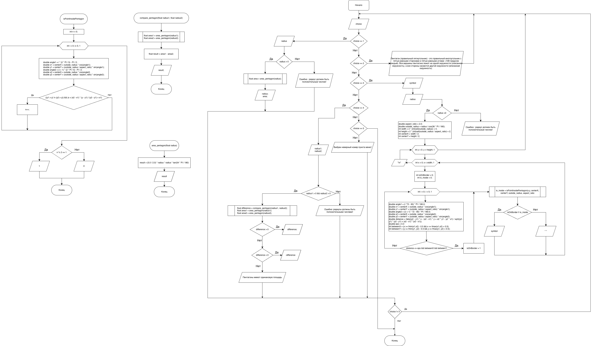

# Домашнее задание к работе 10
## Условие задачи

##### Составьте программу, которая для заданной пользователем фигуры, например прямоугольника (треугольника или другой фигуры см. инидивидуальное задание работы 9) предлагает меню выбора одной из операций:

##### 1) рассчитать площадь;

##### 2) вывести определение фигуры;

##### 3) нарисовать фигуру
##### Фигура: пентагон

---

## 1. Алгоритм и блок-схема

### Алгоритм
1. Начало
2. Алгоритм вычисления площади пентагона:
	- Ввод радиуса вписанной окружности: `radius`
	- Проверка радиуса на положительное значение
	- Вычисление площади пентагона: `float area = area_pentagon(radius);`
	```c
	scanf("%f", &radius);
	if (radius > 0
	{
		float area = area_pentagon(radius);
		printf("Площадь пентагона с радиусом вписанной окружности %.2f = %.4f\n", radius, area);
	}
	else
	{
		printf("Ошибка: радиус должен быть положительным числом!\n");
	}
	```
	- Алгоритм функции `area_pentagon`:
		- Вычисление площади по формуле `(5/2) * R^2 * tan(54°)`
3. Алгоритм вывода определения пентагона:
	- Вывод: `Пентагон (правильный пятиугольник) - это правильный многоугольник с пятью равными сторонами и пятью равными углами  (108 градусов каждый). Все вершины пентагона лежат на одной окружности (описанная окружность), а все стороны касаются другой окружности (вписанная окружность).`
4. Алгоритм отрисовки пентагона
	1. Ввод символа для отображения фигуры:
		 - `printChar`
	2. Ввод радиуса внутренней окружности:
		 - `inside_radius`
	3. Расчёт радиуса описанной окружности:
	```c
	double outside_radius = inside_radius / cos(36 * PI / 180);
	```
	4. Определение размеров поля вывода:
		```c
		int width = 2 * (int)ceil(outside_radius) + 4;
		int height = 2 * (int)ceil(outside_radius / aspect_ratio) + 2;
		```
	5. Определение координат центра пентагона:
		```c
		int centerX = width / 2;
		int centerY = height / 2;
		```
	6. Проход по сторонам пентагона:
		```c
		for (int y = 0; y < height; y++)
		{
			for (int x = 0; x < width; x++)
			{
			//...
			}
		// ...
		}
		```
		1. **Первый этап: поиск границ**:
			- Для каждой точки проверяет принадлежность к границам пятиугольника:
			- Вычисляет расстояние от точки до каждой стороны пятиугольника
			- Если расстояние меньше epsilon (0.3) и точка находится между вершинами стороны - помечает как границу
			```c
			for (int i = 0; i < 5; i++)
			{
				// Угол: i * 72° - 90° (72° = 360° / 5 - центральный угол пентагона)
				// -90° чтобы начать с верхней вершины
				double angle1 = (i * 72 - 90) * PI / 180.0;
				// Координаты текущей вершины с учетом соотношения сторон
				double x1 = centerX + outside_radius * cos(angle1);
				double y1 = centerY + (outside_radius / aspect_ratio) * sin(angle1);
				// Координаты следующей вершины
				double angle2 = ((i + 1) * 72 - 90) * PI / 180.0;
				double x2 = centerX + outside_radius * cos(angle2);
				double y2 = centerY + (outside_radius / aspect_ratio) * sin(angle2);
				// Проверяем, лежит ли точка (x,y) на линии между вершинами
				// Расстоание от точки до прямой = |(y2-y1)*x - (x2-x1)*y + x2*y1 - y2*x1| / √((y2-y1)² + (x2-x1)²)
				double distance = fabs((y2 - y1) * x - (x2 - x1) * y + x2 * y1 - y2 * x1) / sqrt((y2 - y1) * (y2 - y1) + (x2 - x1) * (x2 - x1));
				// Константа для диапазона сканирования точек, определяемых для границы пентагона
				double eps = 0.3;
				// Проекция точки на отрезок лежит между началом и концом отрезка
				int betweenX = (x >= fmin(x1, x2) - 0.5 && x <= fmax(x1, x2) + 0.5);
				int betweenY = (y >= fmin(y1, y2) - 0.5 && y <= fmax(y1, y2) + 0.5);
				// Если точка близко к линии и находится между вершинами - это граница
				if (distance <= eps && betweenX && betweenY)
				{
					isOnBorder = 1;
					break;
				}
			
			}
			```
		2. **Второй этап: проверка нахождения внутри фигуры**
			- Из точки выпускается луч вправо
			- Считается количество пересечений со сторонами пятиугольника
			- Если количество пересечений нечетное - точка внутри фигуры
			```c
			is_inside = isPointInsidePentagon(x, y, centerX, centerY, outside_radius, aspect_ratio);
			```
			```c
			int isPointInsidePentagon(double x, double y, double centerX, double centerY, double outside_radius, double aspect_ratio)
			{
				int n = 0;
				for (int i = 0; i < 5; i++)
				{
					// Вычисляем координаты текущей вершины
					// Угол начинается с -90 градусов (-PI/2) для верхней вершины
					double angle1 = i * (2 * PI / 5) - PI / 2;
					
					double x1 = centerX + outside_radius * cos(angle1);
					
					double y1 = centerY + (outside_radius / aspect_ratio) * sin(angle1);
					
					// Вычисление координаты следующей вершины
					double angle2 = (i + 1) * (2 * PI / 5) - PI / 2;
					
					double x2 = centerX + outside_radius * cos(angle2);
					
					double y2 = centerY + (outside_radius / aspect_ratio) * sin(angle2);
					
					// Проверка, что точка находится между y-координатами вершин и пересечение происходит левее текущей точки x
					if (((y1 > y) != (y2 > y)) && (x < (x2 - x1) * (y - y1) / (y2 - y1) + x1))
					{
						n++;
					}
				}
				
				// Если количество пересечений нечетное - точка внутри фигуры
				if (n % 2 == 1)
				{
					return 1;
				}
				else
				{
					return 0;
				}
			}
			```
	7. Визуализация
		- Для точек, принадлежащих границе или внутренней области, выводит заданный символ
		- Для остальных точек - пробел
		```c
		if (isOnBorder || is_inside)
		{
			printf("%c", printChar);
		}
		else
		{
			printf(" ");
		}
	```
6. Алгоритм сравнения площадей двух пентагонов:
	1. Ввод радиуса первого пентагона: `radius1`
	2. Ввод радиуса второго пентагона: `radius2`
	3. Проверка радиусов двух пентагонов на положительные значения: `if (radius1 > 0 && radius2 > 0)`
	4. Определение разности площадей двух пентагонов: `float difference = compare_pentagon(radius1, radius2);`
		- Алгоритм функции `float compare_pentagon(float radius1, float radius2)`:
			1. Определение площади первого пентагона: `float area1 = area_pentagon(radius1);`
			2. Определение площади второго пентагона: `float area2 = area_pentagon(radius2);`
			3. Вычитание площади второго пентагона из площади первого: `float result = area1 - area2;`
			```c
			float area1 = area_pentagon(radius1);
			float area2 = area_pentagon(radius2);
			float result = area1 - area2;
			return result;
			```
	5. Расчёт площади каждого пентагона и вывод результата сравнения:
		```c
		float area1 = area_pentagon(radius1);
		float area2 = area_pentagon(radius2);
		printf("\nРезультаты сравнения:\n");
		printf("Пентагон 1 (R=%.2f): площадь = %.4f\n", radius1, area1);
		printf("Пентагон 2 (R=%.2f): площадь = %.4f\n", radius2, area2);
		
		if (difference > 0)
		{
			printf("Пентагон 1 больше пентагона 2 на %.4f\n", difference);
		}
		else if (difference < 0)
		{
			printf("Пентагон 2 больше пентагона 1 на %.4f\n", -difference);
		}
		else
		{
			printf("Пентагоны имеют одинаковую площадь\n");
		}
		```
7. Конец

### Блок-схема



[Ссылка на draw.io](https://viewer.diagrams.net/?tags=%7B%7D&lightbox=1&highlight=0000ff&edit=_blank&layers=1&nav=1&title=%D0%94%D0%97%20%E2%84%9610.drawio&dark=auto#Uhttps%3A%2F%2Fdrive.google.com%2Fuc%3Fid%3D1xMr7DH54R7m3l_LniWQAJTZNUm79zJSO%26export%3Ddownload))

---
## 2. Реализация программы

```c
#include <stdio.h>

#include <math.h>

#include <locale.h>

#include <string.h>

#define PI 3.14159265358979323846

float area_pentagon(float radius) {
    // S = (5/2) * R^2 * tan(54°)
    float result = (5.0 / 2.0) * radius * radius * tan(54 * PI / 180);
    return result;
}

int isPointInsidePentagon(double x, double y, double centerX, double centerY, double outside_radius, double aspect_ratio) {
    int n = 0;

    for (int i = 0; i < 5; i++) {

        double angle1 = i * (2 * PI / 5) - PI / 2;

        double x1 = centerX + outside_radius * cos(angle1);

        double y1 = centerY + (outside_radius / aspect_ratio) * sin(angle1);


        double angle2 = (i + 1) * (2 * PI / 5) - PI / 2;

        double x2 = centerX + outside_radius * cos(angle2);

        double y2 = centerY + (outside_radius / aspect_ratio) * sin(angle2);


        if (((y1 > y) != (y2 > y)) &&

            (x < (x2 - x1) * (y - y1) / (y2 - y1) + x1))

        {

            n++;

        }

    }


    return (n % 2 == 1);

}


// Функция для сравнения двух пентагонов по площади

float compare_pentagon(float radius1, float radius2)

{

    float area1 = area_pentagon(radius1);

    float area2 = area_pentagon(radius2);

    float result = area1 - area2;

    return result;

}


int main()

{

    setlocale(LC_ALL, "RUS");


    int choice;

    float radius, radius1, radius2;

    char symbol;


    do

    {

        printf("\nМеню:\n");

        printf("1. Рассчитать площадь пентагона\n");

        printf("2. Вывести определение пентагона\n");

        printf("3. Нарисовать пентагон\n");

        printf("4. Сравнить два пентагона по площади\n");

        printf("5. Выход\n");

        printf("Выберите операцию: ");

        scanf("%d", & choice);


        switch (choice)

        {

            case 1:

                scanf("%f", & radius);

                if (radius > 0)

                {

                    float area = area_pentagon(radius);

                    printf("Площадь пентагона с радиусом вписанной окружности %.2f = %.4f\n",

                        radius, area);

                } else

                {

                    printf("Ошибка: радиус должен быть положительным числом!\n");

                }

                break;


            case 2:

                printf("Пентагон (Правильный пятиугольник) - это правильный многоугольник с пятью равными сторонами\n");

                printf("и пятью равными углами (108 градусов каждый).\n");

                printf("Все вершины пентагона лежат на одной окружности (описанная окружность),\n");

                printf("а все стороны касаются другой окружности (вписанная окружность).\n");

                break;


            case 3:

                printf("Введите символ для отображения фигуры: ");

                scanf(" %c", & symbol);

                // radius = get_radius();

                scanf("%f", & radius);

                if (radius > 0)

                {

                    double aspect_ratio = 2.0;


                    // Вычисляем радиус описанной окружности

                    double outside_radius = radius / cos(36 * PI / 180);


                    int width = 2 * (int) ceil(outside_radius) + 4;

                    int height = 2 * (int) ceil(outside_radius / aspect_ratio) + 2;


                    // Координаты центра пентагона

                    int centerX = width / 2;

                    int centerY = height / 2;


                    for (int y = 0; y < height; y++)

                    {

                        for (int x = 0; x < width; x++)

                        {

                            int isOnBorder = 0;

                            int is_inside = 0;


                            for (int i = 0; i < 5; i++)

                            {

                                double angle1 = (i * 72 - 90) * PI / 180.0;

                                double x1 = centerX + outside_radius * cos(angle1);

                                double y1 = centerY + (outside_radius / aspect_ratio) * sin(angle1);


                                double angle2 = ((i + 1) * 72 - 90) * PI / 180.0;

                                double x2 = centerX + outside_radius * cos(angle2);

                                double y2 = centerY + (outside_radius / aspect_ratio) * sin(angle2);


                                double distance = fabs((y2 - y1) * x - (x2 - x1) * y + x2 * y1 - y2 * x1) /

                                    sqrt((y2 - y1) * (y2 - y1) + (x2 - x1) * (x2 - x1));


                                double eps = 0.3;

                                int betweenX = (x >= fmin(x1, x2) - 0.5 && x <= fmax(x1, x2) + 0.5);

                                int betweenY = (y >= fmin(y1, y2) - 0.5 && y <= fmax(y1, y2) + 0.5);


                                if (distance <= eps && betweenX && betweenY)

                                {

                                    isOnBorder = 1;

                                    break;

                                }

                            }


                            is_inside = isPointInsidePentagon(x, y, centerX, centerY, outside_radius, aspect_ratio);


                            if (isOnBorder || is_inside)

                            {

                                printf("%c", symbol);

                            } else

                            {

                                printf(" ");

                            }

                        }

                        printf("\n");

                    }

                } else

                {

                    printf("Ошибка: радиус должен быть положительным числом!\n");

                }

                break;


            case 4:

                printf("Первый пентагон:\n");

                scanf("%f", & radius1);

                printf("Второй пентагон:\n");

                scanf("%f", & radius2);


                if (radius1 > 0 && radius2 > 0)

                {

                    float difference = compare_pentagon(radius1, radius2);

                    float area1 = area_pentagon(radius1);

                    float area2 = area_pentagon(radius2);


                    printf("\nРезультаты сравнения:\n");

                    printf("Пентагон 1 (R=%.2f): площадь = %.4f\n", radius1, area1);

                    printf("Пентагон 2 (R=%.2f): площадь = %.4f\n", radius2, area2);


                    if (difference > 0)

                    {

                        printf("Пентагон 1 больше пентагона 2 на %.4f\n", difference);

                    } else if (difference < 0)

                    {

                        printf("Пентагон 2 больше пентагона 1 на %.4f\n", -difference);

                    } else

                    {

                        printf("Пентагоны имеют одинаковую площадь\n");

                    }

                } else

                {

                    printf("Ошибка: радиусы должны быть положительными числами!\n");

                }

                break;


            case 5:

                break;


            default:

                printf("Выбран неверный номер пункта меню!\n");

        }


    } while (choice != 5);


    return 0;

}
```

# 3. Результаты работы программы

```bash
Меню:
1. Рассчитать площадь пентагона
2. Вывести определение пентагона
3. Нарисовать пентагон
4. Сравнить два пентагона по площади
5. Выход
Выберите операцию: 1
Введите радиус вписанной окружности пентагона: 10
Площадь пентагона с радиусом вписанной окружности 10.00 = 344.0955

Меню:
1. Рассчитать площадь пентагона
2. Вывести определение пентагона
3. Нарисовать пентагон
4. Сравнить два пентагона по площади
5. Выход
Выберите операцию: 2
Пентагон (Правильный пятиугольник) - это правильный многоугольник с пятью равными сторонами
и пятью равными углами (108 градусов каждый).
Все вершины пентагона лежат на одной окружности (описанная окружность),
а все стороны касаются другой окружности (вписанная окружность).

Меню:
1. Рассчитать площадь пентагона
2. Вывести определение пентагона
3. Нарисовать пентагон
4. Сравнить два пентагона по площади
5. Выход
Выберите операцию: 3
Введите символ для отображения фигуры: *  
Введите радиус вписанной окружности пентагона: 10
                              
                              
              ***             
           *********          
         *************        
      *******************     
   *************************  
    ***********************   
     *********************    
     *********************    
      *******************     
       *****************      
       *****************      
        ***************       
                              
                              

Меню:
1. Рассчитать площадь пентагона
2. Вывести определение пентагона
3. Нарисовать пентагон
4. Сравнить два пентагона по площади
5. Выход
Выберите операцию: 4
Введите радиус вписанной окружности первого пентагона: 10
Введите радиус вписанной окружности второго пентагона: 20

Результаты сравнения:
Пентагон 1 (R=10.00): площадь = 344.0955
Пентагон 2 (R=20.00): площадь = 1376.3820
Пентагон 2 больше пентагона 1 на 1032.2865

Меню:
1. Рассчитать площадь пентагона
2. Вывести определение пентагона
3. Нарисовать пентагон
4. Сравнить два пентагона по площади
5. Выход
Выберите операцию: 5
```

# 4. Информация о разработчике
#### Сафонов Павел Романович бИПТ-251